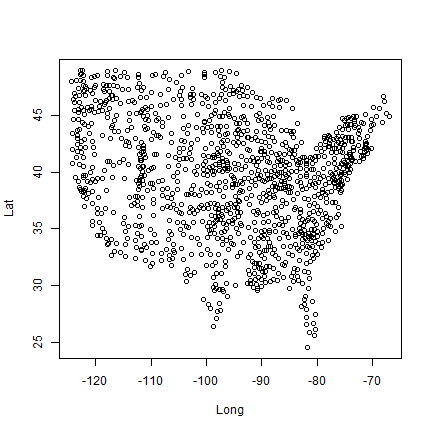

Opening files and getting started.
========================================================

Obviously, as this workshop progresses it might be impractical to use these outlines since we will be creating files in an ongoing manner.

This workshop is to help you see how to start a project (using pre-defined data) and how to open a variety of files you might come into contact with.

If you've created a GitHub account and forked (and cloned) this repository you will see that you have a number of folders[1].  The repository already has a few folders filled.  In particular, take a look at `data`.  

Folder | Contents | File Type | open file function
---------- | -------- | ----- | -----------
input  | compiled.pollen.RData | R data file | `load` {base}
input\Ecoregions_NA | `na_regns` | Shapefile | `readOGR` {rgdal}
input\PalEONSites | PaleonSites | Shapefile  | `readOGR` {rgdal}
input\USHCN | 9641C_201112_F52.pcp | fixed width text file | `read_fwf` {base}
input\USHCN | ushcn-stations.csv   | comma separated values | `read.csv` {base}

So here we have three kinds of data (generally).  We have spatial data for North American ecozones, we have spatio-temporal data for precipiation (over the last 110 years) for the United States and we have spatio-temporal pollen data across North America for the last ~21000 years.

Let's start by opening up the pollen data.  First, lets look at where the points are located by opening the metadata file:


```r
# This file is located in the folder 'docs', let's move the working
# directory down to the base directory:

setwd("..")

# Now open the station data.  By default R converts strings to a factor, but
# this is annoying behaviour, so we change the behaviour, setting
# 'stringsAsFactors' to FALSE
stations <- read.csv("input/USHCN/ushcn-stations.csv", stringsAsFactors = FALSE)

head(stations)
```

```
##      ID   Lat   Long    El State          Station   Val1   Val2   Val3
## 1 11084 31.06 -87.05  25.9    AL    BREWTON 3 SSE ------ ------ ------
## 2 12813 30.55 -87.88   7.0    AL    FAIRHOPE 2 NE ------ ------ ------
## 3 13160 32.83 -88.13  38.1    AL GAINESVILLE LOCK  11694 ------ ------
## 4 13511 32.70 -87.58  67.1    AL       GREENSBORO ------ ------ ------
## 5 13816 31.87 -86.25 132.0    AL    HIGHLAND HOME ------ ------ ------
## 6 15749 34.74 -87.60 164.6    AL MUSCLE SHOALS AP ------ ------ ------
##   Quality
## 1       6
## 2       6
## 3       6
## 4       6
## 5       6
## 6       6
```


Lets plot out the station locations:


```r
plot(Lat ~ Long, data = stations)
```

 


Now lets see how these fit into ecozones.

```r
library(rgdal)
```

```
## Loading required package: sp
## rgdal: version: 0.8-14, (SVN revision 496)
## Geospatial Data Abstraction Library extensions to R successfully loaded
## Loaded GDAL runtime: GDAL 1.10.1, released 2013/08/26
## Path to GDAL shared files: C:/Users/Simon Goring/Documents/R/win-library/3.0/rgdal/gdal
## GDAL does not use iconv for recoding strings.
## Loaded PROJ.4 runtime: Rel. 4.8.0, 6 March 2012, [PJ_VERSION: 480]
## Path to PROJ.4 shared files: C:/Users/Simon Goring/Documents/R/win-library/3.0/rgdal/proj
```

```r

file <- list.files("../input/Ecoregions_NA", full.names = TRUE)
file <- file[regexpr("shp$", file) > 0]
ecozones <- readOGR(dsn = file, layer = "na_regns")
```

```
## OGR data source with driver: ESRI Shapefile 
## Source: "../input/Ecoregions_NA/na_regns.shp", layer: "na_regns"
## with 591 features and 10 fields
## Feature type: wkbPolygon with 2 dimensions
```

```r

# reproject ecozones
ecozones_ll <- spTransform(ecozones, CRSobj = CRS("+proj=longlat +ellps=WGS84"))

plot(ecozones)
points(Lat ~ Long, data = stations)
```

 


[1]: See [Getting started with GitHub](http://downwithtime.wordpress.com/2013/09/13/writing-and-collaborating-on-github-a-primer-for-paleoecologists/) for an example.
